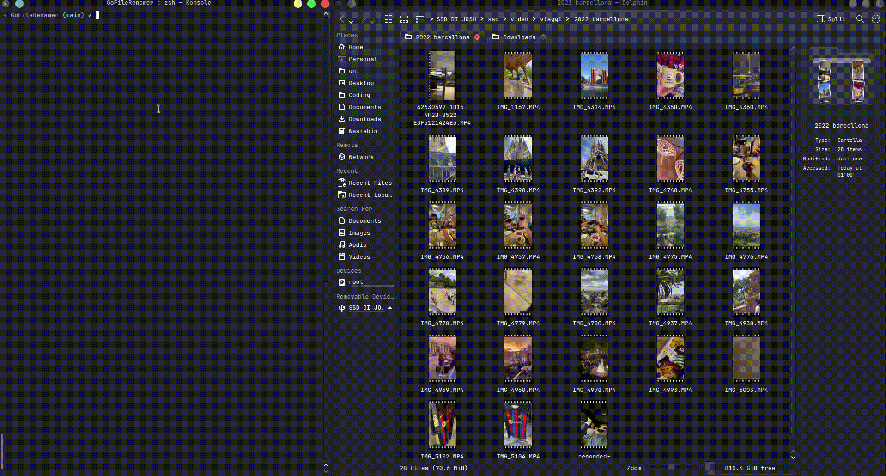

# Video Metadata Extractor

This Go program extracts the creation date from video files in a specified directory and renames the files with the formatted date.

## Usage

```bash
go run main.go <directory_path>
```

Replace `<directory_path>` with the path to the directory containing your video files.

## How It Works

The program uses `ffmpeg` to extract metadata from each video file. It then parses the `creation_time` from the metadata, which it uses to rename the file.


## Requirements

- Go
- ffmpeg

## Limitations

The program currently only works with video files that have a `creation_time` in their metadata. Not all videos may have this metadata, depending on how they were recorded and processed.

